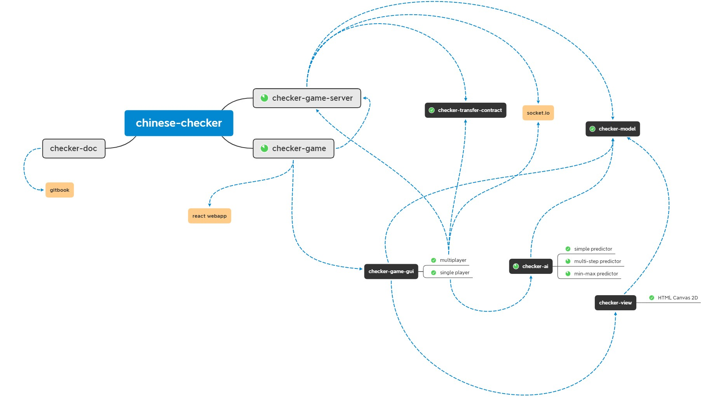

# 简介

## 跳棋游戏<sup>[1]</sup>

#### 起源

中国跳棋（英语：Chinese checkers，德语：Sternhalma），经常被简称为跳棋，在粤语中也称波子棋，是一种可以有二至六人（但不可五人）同时进行的棋盘游戏，棋盘为六角星，棋子分为六种颜色，每位玩家拥有一种颜色的棋子并摆满一个角，以最先将己方棋子全部移动至对角为优胜。中国跳棋起源于美国，实际上和中国没有关系，只是为了从营销角度上增加神秘感。


#### 行棋规则

每个人在自己的回合内，可以按照规则移动一枚棋子，中国跳棋中不存在“吃子”，棋子只能落在未被占据的位置。棋子的走法有平移和跳跃共2种，因为需要将己方的棋子全部移动至对角，棋子的行进速度成了决定胜负的关键，一般以能前进距离多的走法为优。相邻两点的距离称为一格，从游戏开始，一方全部棋子前进的总格数越多，则场面越是优势。

平移是基本的走法，一个棋子可以向周围相邻的6个位置中的一个进行移动，称为一次平移。平移的前进步数固定为一格，因此效率也是最低。

跳跃是主要的走法，指的是一个棋子可以跳过另一枚棋子，如此每次走棋至少会行走2格。自己棋子A的同一直线的连线上有另一枚棋子B（B不限属于哪一方），那么A能以B为中心，通过镜像方式达到直线的另一边，但前提是A的行进路线中没有B以外的棋子阻挡。这样A跳过B后，和B的距离保持不变，称为一次跳跃。但有些跳棋中的跳跃规则为一子规则，一个棋子只能跳过邻近的棋子，到邻近棋子后方的空位。

如果A和B相邻，那么A跳跃一次就是前进了2格，如果A和B中间空一格，那么A跳跃一次就是前进了4格，以此类推。在自己走棋的那一个回合，如果跳跃了一次后，此棋子又可进行另一次跳跃，那么跳跃可以连续进行，不用等到下一回合，直至跳无可跳为止，或者玩家也可选其中任意一处停下。

#### 规则变化

在网络游戏中和比赛中经常出现一些各自的规则，玩家在娱乐时也可以自行订立规则。比如跳跃在传统规则下可以长距离进行，但玩家可以限定于两只棋子必须相邻才可跳跃，即每次跳跃只能行进2格，同时也可以对是否可以连续跳跃作出规定。另外，对于棋子是否可以进入旁边的角内，即相邻玩家的大本营内，也可以作出具体要求。

## 项目说明

#### 基本结构

本项目基于HTML+CSS+JavaScript技术在浏览器端实现了一个简单的图形化跳棋游戏，主要包含以下几个部分：

* checher-model: 抽象的跳棋棋盘数据结构；
* checker-ai: 基于model模块的三种跳棋行棋ai程序，并且定义了抽象的预测行棋接口，支持二次开发扩展；
* checker-view: 抽象的跳棋视图，以及在html canvas 2d<sup>[2]</sup>下的实现；
* checker-game-gui: 包装了view和model，包含跳棋游戏状态机的GUI组件；
* checker-game-webapp: 基于React实现的Web单页面应用<sup>[3]</sup>，支持单人/多人游戏；
* checker-game-server: 基于socket.io<sup>[4]</sup>实现了多人游戏的简单通信服务器，支持多人同时进行多场游戏；
* checker-transfter-cotract: 定义了server服务器支持的接口契约，便于客户端接入；
* checker-doc: 基于gitbook编写的说明文档<sup>[5]</sup>；

大致结构如图所示:



#### 运行命令

安装依赖

```shell
npm i
```

或

```shell
yarn
```

代码构建(以下以npm为例, yarn在此不再赘述)

```shell
npm run build
```

单元测试

```shell
npm test
```

本地启动WebApp客户端

```shell
npm start
```

本地启动多人服务器

```shell
# 启动
npm run server

# 开启调试
npm run debug:server
```

启动gitbook在线文档

```
npm run doc
```

## 参考文档

[1] [本节摘录自维基百科:中国跳棋](https://zh.wikipedia.org/wiki/%E4%B8%AD%E5%9C%8B%E8%B7%B3%E6%A3%8B)

[2] [MDN:canvas简介](https://developer.mozilla.org/en-US/docs/Web/API/Canvas_API)

[3] [React](https://reactjs.org/)

[4] [socket.io](https://socket.io/)

[5] [gitbook](https://www.gitbook.com/)
