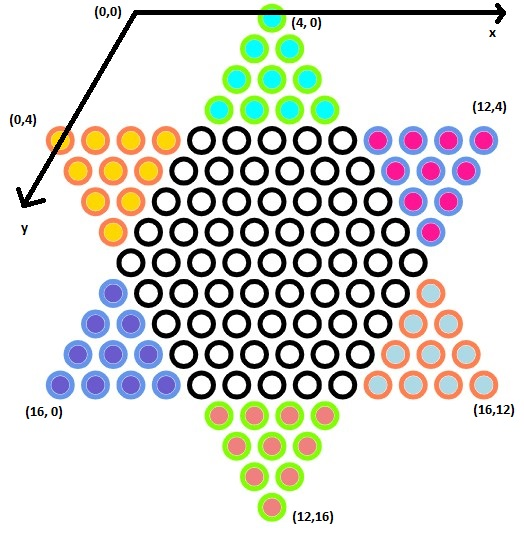
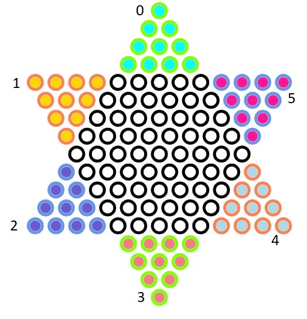

# 棋盘、阵营与棋子

## 棋盘

基于二维矩阵描述了跳棋棋盘的每个槽位，以及各个位置的棋子信息。

#### 坐标系

由于跳棋棋盘不是一个标准的直角坐标系，而是一个拥有60°角的结构，所以我们需要使用斜坐标来定义跳棋的结构。

本项目中，跳棋棋盘的坐标定义如下:



由上图可知，棋盘的范围是17×17，原点位于棋盘之外；每一行只有部分列在棋盘内，而其他列是不合法的。

可以通过定义常量来表示某一行下合法列数的范围，如下：

```typescript
// (x, y)满足VALID_COORDINATES[y][0] <= x <= VALID_COORDINATES[y][1]时在棋盘内
const VALID_COORDINATES = [
  [4, 4],
  [4, 5],
  [4, 6],
  [4, 7],
  [0, 12],
  [1, 12],
  [2, 12],
  [3, 12],
  [4, 12],
  [4, 13],
  [4, 14],
  [4, 15],
  [4, 16],
  [9, 12],
  [10, 12],
  [11, 12],
  [12, 12],
];
```

#### 槽位

跳棋棋盘主结构是一个二维数组，数组中的每个结构在此称之为“槽位”。

槽位内可以有棋子，也可以为空；槽位有自己的属性slotCategory，用来标识这个槽位是否属于某个阵营的“起点”或“终点”。

其结构定义如下:

```typescript
type SlotCategory = 0 | 1 | 2 | 'unavailable' | 'neutral';

type Slot = {
  /**
   * chess piece
   */
  piece: null | IPiece;

  /**
   * slot category, empty /  faction's start point / faction's end point
   */
  slotCategory: SlotCategory;
};
```

关于SlotCategory的定义如下:

* 'unavailable'表示这个槽位不可用，即棋子无法走到这里；
* 'neutral'表示该槽位为中立位置，即不是任何阵营的起点或终点；
* 0, 1, 2表示槽位是某个阵营的起点和终点，由于跳棋一共有6个阵营，并且正对的阵营起点和终点正好相对，所以一共有三种集合；

SlotCategory主要用于视图层的着色和绘制；

piece字段存在时，表示当前槽位存在棋子，棋子对象定义见下节。

#### 接口定义

棋盘的结构内除定义了基本的槽位矩阵，还聚合了阵营及每个阵营的棋子列表，便于行棋轨迹的记录和胜负的判断；

接口定义如下:

```typescript
interface IBoard {
  /**
   * get availale position
   */
  getAvailableJumpPosition(coordinate: Coordinate): Coordinate[];

  /**
   * move chess
   */
  move(from: Coordinate, to: Coordinate): boolean;

  /**
   * rollback last moving
   */
  rollback(): boolean;

  /**
   * put chess
   */
  put(piece: IPiece): boolean;

  /**
   * get chess by coordinate
   */
  get(coordinate: Coordinate): IPiece | null;

  /**
   * reset board
   */
  reset(): IBoard;

  /**
   * get move actions
   */
  getActionList(): MoveStep[];

  /**
   * get slot matrix
   */
  getSlotMatrix(): Slot[][];
}
```

其中:

* reset方法用于初始化棋盘对象
* getAvailableJumpPosition方法定义了基于跳棋规则下，某个棋子可以行走的位置，通过BFS算法进行搜索
* move/put/rollback方法定义了移动棋子的操作
* getActionList方法用于获取移动的历史记录列表
* getSlotMatrix方法用于获取棋盘底层的二维数组结构
* get方法用于获取某个坐标下槽位的具体信息

## 棋子

棋子对象包含了获取坐标位置和所属阵营的接口，便于在移动时迅速找到其在棋盘中的坐标下标，以及迅速判断阵营的胜负情况；

同时棋子也提供了移动位置的接口，简化阵营移动棋子的操作；

接口定义如下：

```typescript
interface IPiece {
  /**
   * move a piece
   */
  moveTo(coordinate: Coordinate): boolean;

  /**
   * get faction id
   */
  getFactionId(): FactionIdentity | null;

  /**
   * get status
   */
  getStatus(): 'neutral' | 'start' | 'goal';

  /**
   * get current coordinate
   */
  getCoordinate(): Coordinate;
}
```

## 阵营

根据跳棋规则，一个棋盘可以容纳6个玩家，以正上方玩家为0号阵营，以逆时针依次递增，可以定义6个阵营：

```typescript
type FactionIdentity = 0 | 1 | 2 | 3 | 4 | 5;
```

分别对应棋盘各个位置如下:



#### 起点与终点

根据上文棋盘坐标的定义，可知每个阵营的起点集合和终点集合，以阵营0为例，其起点集合坐标定义如下:

```typescript
[
    { x: 4, y: 0 },
    { x: 4, y: 1 },
    { x: 5, y: 1 },
    { x: 4, y: 2 },
    { x: 5, y: 2 },
    { x: 6, y: 2 },
    { x: 4, y: 3 },
    { x: 5, y: 3 },
    { x: 6, y: 3 },
    { x: 7, y: 3 },
]
```

其他阵营同理。

并且各个阵营的起点和终点集合满足条件:

> 阵营i的起点集合 等价于 阵营(i+3) mod 6的终点集合

当阵营所有棋子到达终点，即判定该阵营胜利；所有阵营胜利则游戏结束；

#### 接口定义

阵营对象应当维护所有当前阵营的棋子对象，以便快速判断胜负情况；

保存棋子信息也便于GUI程序和AI程序作行棋判断。

```typescript
interface IFaction {
  /**
   * get current faction id
   */
  getId(): FactionIdentity;

  /**
   * reset the faction
   */
  reset(): IFaction;

  /**
   * check whether the faction wins
   */
  checkWin(): boolean;

  /**
   * add a chess piece to faction
   */
  addPiece(coordinate: Coordinate): IFaction;

  /**
   * init pieces by faction
   */
  initPieces(coordinate?: Coordinate[]): IFaction;

  /**
   * get pieces
   */
  getPieces(): IPiece[];

  /**
   * get goal points
   */
  getStartCoordinates(): Coordinate[];

  /**
   * get start points
   */
  getGoalCoordinates(): Coordinate[];

  /**
   * check whether coordinate is the goal point
   */
  isStartCoordinate(coordinate: Coordinate): boolean;

  /**
   * check whether coordinate is the start point
   */
  isGoalCoordinate(coordinate: Coordinate): boolean;
}
```

* initPieces, addPiece, getPieces用于获取/设置持有棋子的信息
* checkWin用于快速判断当前阵营是否已经获胜
* getStartCoordinates/getGoalCoordinates/isStartCoordinate/isGoalCoordinate用于获取当前阵营的起始点集合信息
