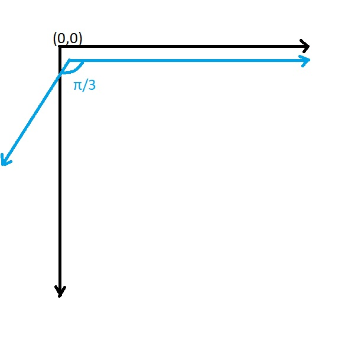

# 画布与绘图元素

## 画布

画布接口定义了绘制图形的一系列方法和属性,本项目下主要实现以下功能:

* 绘图坐标系
* 调色板和颜色
* 填充类型
* 绘制线条的方法
* 绘制圆圈的方法
* 设置像素点颜色的方法

画布的接口定义:

```typescript
export interface ICanvas<TCoordinate, TColor> extends IEventListener<TCoordinate> {
  /**
   * canvas coordinate scale
   */
  getScale(): Scale<TCoordinate>;
  setScale(scale: Scale<TCoordinate>): ICanvas<TCoordinate, TColor>;

  /**
   * pallete object
   */
  getPallete(): IPallete<TColor>;

  /**
   * fill mode
   */
  getFillMode(): FillMode;
  setFillMode(fm: FillMode): ICanvas<TCoordinate, TColor>;

  /**
   * set color
   */
  setColor(color: number): boolean;
  getColor(): number;

  /**
   * put pixel method
   */
  putPixel(coord: TCoordinate): boolean;

  /**
   * draw cirle
   */
  circle(coord: TCoordinate, r: number): boolean;

  /**
   * draw line
   */
  line(begin: TCoordinate, end: TCoordinate): boolean;
}
```

## 调色板

调色板对象是一个字典结构，定义了逻辑颜色下标到渲染颜色映射关系


```typescript
export interface IPallete<TColor> {
  getDefaultColorKey(): number;
  getDefaultColor(): TColor;
  getColor(key: number): TColor;
}
```

在基于浏览器canvas对象的实现中，渲染颜色可以通过字符串来表示，比如"#FF0000"或"Red"都可以表示红色

## 坐标与转换

Canvas画布有自己的绘图坐标系。需要将跳棋棋盘对象作转换之后，方能正确的绘制在Canvas上

##### 坐标

Canvas的坐标定义如下:

```typescript
export type Scale<TCoordinate> = {
  leftTop: TCoordinate;
  rightBottom: TCoordinate;
};
```

直接通过定义左上角和右下角的坐标来确定坐标系的范围

其中坐标点使用的泛型，便于后续实现2D或3D的坐标。

##### 转换

同理，定义转换接口如下:

```typescript
export interface ITransform<TCoordinate> {
  transform(from: TCoordinate): TCoordinate;
  untransform(to: TCoordinate): TCoordinate;
}
```

转换接口拥有正向和反向运算的方法。在渲染图形时需要用transform方法将跳棋逻辑坐标转换为绘图坐标，在监听交互事件时需要将绘图坐标逆向转换为逻辑坐标

同时定义了可转换对象的接口如下:

```typescript
export interface ITransformable<TCoordinate> extends ITransform<TCoordinate> {
  getTransforms(): ITransform<TCoordinate>[];
  setTransforms(trans: ITransform<TCoordinate>[]);
  addTransform(trans: ITransform<TCoordinate>);
}
```

由于“转换”操作是可以复合的，所以ITransformable对象聚合了多个转换接口，用于组合转换操作。

绘制跳棋棋盘的画布对象需要同时实现ICanvas和ITransformable接口。

##### 转换方法实现

以目前基于HTML Canvas 2D实现的棋盘画布为例，需要对坐标进行平移、缩放和旋转的转换：



以坐标轴旋转为例，我们需要将直角坐标转换为斜坐标，转换公式如下:

transform正向转换:

$$
\left\{ \begin{matrix}
x'=&x-y\sin(\theta) \\
y'=&y\cos(\theta)
\end{matrix} \right.
$$

untransform反向转换:

$$
\left\{ \begin{matrix}
x=&x'+y'\tan(\theta) \\
y=&\frac{y'}{\cos(\theta)}
\end{matrix} \right.
$$


## 绘图方法

ICanvas类下定义并实现了三种绘图方法，分别为

* 绘制像素点
* 绘制直线
* 绘制圆

理论上,只需要实现第一个绘制像素点方法,就可以通过简单的图形学计算来实现画线和画圆。

如可以根据直线方程$ax+by+c=0$来绘制直线;

同理可以通过圆的方程$$(x-a)^2+(y-b)^2=r^2$$绘制圆,并且根据$$(x-a)^2+(y-b)^2 \lt r^2$$来填充内部的颜色。

但是在实际基于HTML Canvas的实现过程中，可以基于Canva自带的绘制直线和圆的系统API来简化绘制,例如可以使用以下方法绘制空心或者实心圆:

```typescript
circle(coord: Coordinate, r: number): boolean {
  coord = this.transform(coord);

  this.deviceContext.beginPath();
  this.deviceContext.arc(coord.x, coord.y, r, 0, Math.PI * 2);

  if (this.getFillMode() == 'fill') {
    this.deviceContext.fill();
  } else {
    this.deviceContext.stroke();
  }

  return true;
}
```
