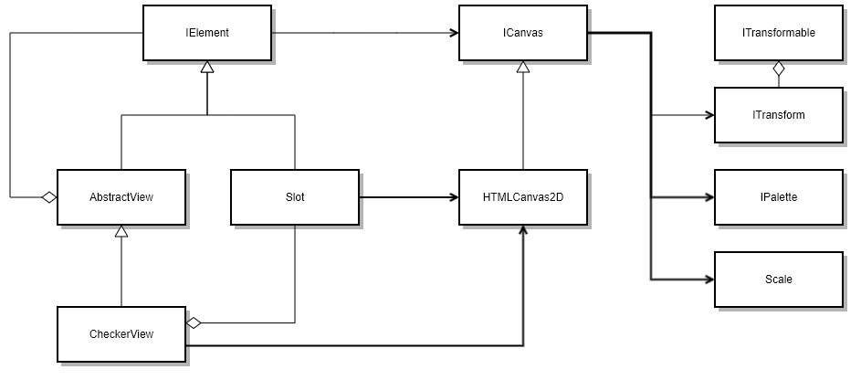

# 视图层

视图层定义了绘图相关的接口，并简单的完成了基于HTML Cavans Api的2d实现。

相关接口定义如下:

* IElement: 视图元素
* IView: 视图
* ICanvas: 画布
* ITransform: 坐标变换接口
* IPallete: 调色板
* Color: 颜色对象
* Scale: 绘图坐标系

对外暴露CheckerView和HTMLCanvas2D对象,用来描述棋盘画布和棋盘视图基于HTML Canvas对象的二维实现

简化的UML图可绘制如下:

